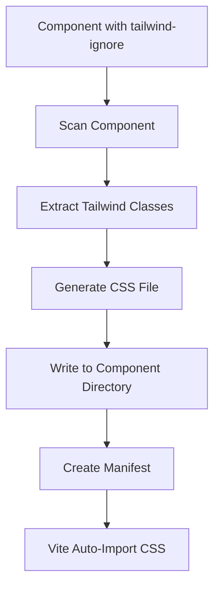

# ✅ Individual Component CSS - COMPLETE

## 🎯 What Was Implemented

Automated **individual component CSS generation** system that:
1. **Detects** components marked with `tailwind-ignore`
2. **Extracts** Tailwind classes from component
3. **Generates** minimal CSS file with only needed utilities
4. **Co-locates** CSS file next to component `.vue` file
5. **Auto-imports** CSS when component is used

---

## 📁 Where Styles Are Stored

### **Co-Located with Component** ✅

```
src/components/MyComponent.vue   ← Your component
src/components/MyComponent.css   ← Auto-generated CSS (same directory)
```

### Example:

```
src/
  components/
    dashboard/
      HeavyChart.vue          ← Component
      HeavyChart.css          ← Generated CSS (co-located)
    special/
      DataTable.vue           ← Component  
      DataTable.css           ← Generated CSS (co-located)
```

---

## 🚀 How to Use

### Step 1: Mark Component for Individual CSS

Add **ONE** of these markers to your component:

**Option A: HTML Comment** (Recommended)
```vue
<!-- tailwind-ignore -->
<template>
  <div class="p-4 bg-white">...</div>
</template>
```

**Option B: Export Constant**
```vue
<script setup>
export const IGNORE_TAILWIND = true;
</script>

<template>
  <div class="p-4 bg-white">...</div>
</template>
```

### Step 2: Generate CSS

**Automatic** (during build):
```bash
npm run build
```

**Manual** (development):
```bash
node build/tailwind/generateIndividualCss.js
```

### Step 3: Use Component

CSS is **automatically imported** via Vite:

```vue
<script setup>
import HeavyChart from '@/components/dashboard/HeavyChart.vue';
// CSS from HeavyChart.css is auto-loaded
</script>

<template>
  <HeavyChart />
</template>
```

---

## 📦 What Gets Generated

### Component File
```vue
<!-- src/components/chart/SalesChart.vue -->
<!-- tailwind-ignore -->
<template>
  <div class="p-8 bg-white rounded-lg shadow-xl">
    <h2 class="text-2xl font-bold mb-4">Sales Data</h2>
    <div class="chart-container flex items-center justify-center">
      <!-- Chart content -->
    </div>
  </div>
</template>
```

### Generated CSS File
```css
/**
 * Auto-generated Tailwind CSS for SalesChart
 * This file is generated automatically by the build system.
 * 
 * Component: src/components/chart/SalesChart.vue
 * Generated: 2025-01-15T10:30:00.000Z
 * Classes: 10
 */

/* Import Tailwind base, components, and utilities */
@tailwind base;
@tailwind components;
@tailwind utilities;

/* Component-specific styles */
/* Tailwind will purge unused classes during build */

/* Detected classes: p-8, bg-white, rounded-lg, shadow-xl, text-2xl, font-bold, mb-4, flex, items-center, justify-center */
```

**Location**: `src/components/chart/SalesChart.css` (same directory)

---

## 🔧 Commands

### Generate Individual CSS
```bash
node build/tailwind/generateIndividualCss.js
```

### Clean Up Generated CSS
```bash
node build/tailwind/generateIndividualCss.js --clean
```

### Generate with Cleanup
```bash
node build/tailwind/generateIndividualCss.js --clean
```

---

## 🎨 Build Process Flow



1. **Scan**: Finds all `.vue` files with `tailwind-ignore` marker
2. **Extract**: Parses template to find Tailwind classes (e.g., `p-4`, `bg-white`)
3. **Generate**: Creates CSS with Tailwind imports and detected classes
4. **Co-locate**: Writes `.css` file next to `.vue` file
5. **Manifest**: Creates JSON mapping of component → CSS paths
6. **Auto-import**: Vite automatically imports CSS when component is used

---

## 📊 Benefits

### Individual CSS ✅
- ✅ Smaller initial bundle (CSS loaded only when needed)
- ✅ Better code splitting per component
- ✅ Lazy loading of heavy component styles
- ✅ No CSS bloat in section bundles

### Section CSS (Default) ✅
- ✅ Fewer HTTP requests
- ✅ Better caching across components
- ✅ Faster initial load for frequently-used sections

**You can mix both approaches!**

---

## 🛠️ Configuration

### Environment Variables

```bash
# Enable build-time logging
VITE_ENABLE_LOGGER=true
```

### Tailwind Config

Individual component CSS inherits from main `tailwind.config.js`:

```javascript
// tailwind.config.js
export default {
  theme: {
    extend: {
      colors: {
        primary: '#ff0066'
      }
    }
  }
}
```

All individual CSS files will use these theme settings.

---

## 🔍 Troubleshooting

### CSS Not Generated?

**Check:**
1. ✅ Marker is correct: `<!-- tailwind-ignore -->` or `export const IGNORE_TAILWIND = true`
2. ✅ Component is in `src/` directory
3. ✅ Run generation script: `node build/tailwind/generateIndividualCss.js`
4. ✅ Check console for errors

### CSS Not Loading?

**Check:**
1. ✅ CSS file exists next to component
2. ✅ Vite dev server is running
3. ✅ Component is actually imported and used
4. ✅ Clear browser cache

### Styles Duplicated?

**Check:**
1. ✅ Component has `tailwind-ignore` marker
2. ✅ Rebuild section CSS: `npm run build`
3. ✅ Clear `dist/` folder
4. ✅ Ensure component is excluded from section scanning

---

## 📂 Files Created

| File | Purpose |
|------|---------|
| `build/tailwind/individualCssGenerator.js` | Core CSS generation logic |
| `build/tailwind/generateIndividualCss.js` | CLI script for generation |
| `build/tailwind/README.md` | Documentation |
| `{Component}.css` | Generated CSS (co-located with components) |
| `dist/component-css-manifest.json` | Manifest of component → CSS mappings |

---

## ✅ Integration Complete

### Works With:
- ✅ Vite HMR (Hot Module Replacement)
- ✅ Section-based CSS system
- ✅ Preload exclusion (`preloadExclude: true`)
- ✅ Route configuration
- ✅ Build pipeline

### Auto-Generated CSS:
- ✅ During `npm run build`
- ✅ Via CLI script
- ✅ On-demand during development

---

## 🎉 Summary

You now have **automated individual component CSS generation** that:

1. **Marks** components with `<!-- tailwind-ignore -->`
2. **Generates** CSS files automatically (co-located next to components)
3. **Loads** CSS only when component is used
4. **Optimizes** bundle size by splitting CSS per component
5. **Integrates** seamlessly with Vite and section-based system

**CSS files are stored: RIGHT NEXT TO YOUR COMPONENT FILES** ✅

```
MyComponent.vue  ← Your component
MyComponent.css  ← Auto-generated Tailwind CSS
```

**No configuration needed. Just add the marker and build!** 🚀

